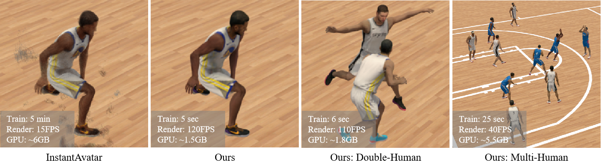

# Animatable 3D Gaussian
[Yang Liu*](https://github.com/jimmyYliu), Xiang Huang*, [Minghan Qin](https://minghanqin.github.io/), [Qinwei Lin](https://scholar.google.com/citations?user=3UefEmMAAAAJ&hl=zh-CN), [Haoqian Wang](https://www.sigs.tsinghua.edu.cn/whq_en/main.htm) (* indicates equal contribution)<br>
## | [Webpage](https://jimmyyliu.github.io/Animatable-3D-Gaussian/) | [Arxiv](https://arxiv.org/pdf/2311.16482.pdf) | [Paper](https://dl.acm.org/doi/abs/10.1145/3664647.3680674)


Abstract: *Neural radiance fields are capable of reconstructing high-quality drivable human avatars but are expensive to train and render and not suitable for multi-human scenes with complex shadows. To reduce consumption, we propose Animatable 3D Gaussian, which learns human avatars from input images and poses. We extend 3D Gaussians to dynamic human scenes by modeling a set of skinned 3D Gaussians and a corresponding skeleton in canonical space and deforming 3D Gaussians to posed space according to the input poses. We introduce a multi-head hash encoder for pose-dependent shape and appearance and a time-dependent ambient occlusion module to achieve high-quality reconstructions in scenes containing complex motions and dynamic shadows. On both novel view synthesis and novel pose synthesis tasks, our method achieves higher reconstruction quality than InstantAvatar with less training time (1/60), less GPU memory (1/4), and faster rendering speed (7x). Our method can be easily extended to multi-human scenes and achieve comparable novel view synthesis results on a scene with ten people in only 25 seconds of training.*


## Prerequisites

* Cuda 11.7
* Conda
* A C++14 capable compiler
  * __Windows:__ Visual Studio 2019 or 2022
  * __Linux:__ GCC/G++ 8 or higher

## Setup
First make sure all the Prerequisites are installed in your operating system. Then, invoke

```bash
conda create --name anim-gaussian python=3.8
conda activate anim-gaussian
bash ./install.sh
```

## Prepare Data
We use PeopleSnapshot and GalaBasketball datasets and correspoding template body model. Please [download](https://drive.google.com/drive/folders/1xyLF7UwIrUaU5KU0IsEjYrz9hdTeZuza?usp=sharing) and organize as follows
```bash
|---data
|   |---Gala
|   |---PeopleSnapshot
|   |---smpl
```

## Train
To train a scene, run

```bash
python train.py --config-name <main config file name> dataset=<path to dataset config file>
```

For the PeopleSnapshot dataset, run
```bash
python train.py --config-name peoplesnapshot.yaml dataset=peoplesnapshot/male-3-casual
```

For the GalaBasketball dataset, run
```bash
python train.py --config-name gala.yaml dataset=gala/idle
```

## Test

To test the trained model performance on the test set, run
```bash
python test.py --config-name <main config file name> dataset=<path to dataset config file>
```

To animate the trained model at the novel poses, run
```bash
python test.py --config-name animate.yaml output_path=<path to train output> dataset=<path to animation dataset config file>
```

For example, to animate the model trained on the idle dataset using poses on the dribble dataset, run
```bash
python test.py --config-name animate.yaml output_path=idle dataset=gala/dribble
```

<section class="section" id="BibTeX">
  <div class="container is-max-desktop content">
    <h2 class="title">Citation</h2>
    <pre><code>@inproceedings{liu2024animatable,
  title={Animatable 3d gaussian: Fast and high-quality reconstruction of multiple human avatars},
  author={Liu, Yang and Huang, Xiang and Qin, Minghan and Lin, Qinwei and Wang, Haoqian},
  booktitle={Proceedings of the 32nd ACM International Conference on Multimedia},
  pages={1120--1129},
  year={2024}
}</code></pre>
  </div>
</section>
